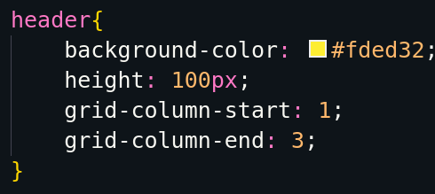
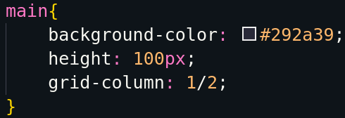

# CSS GRID
[Guia completo da Origamid](https://www.origamid.com/projetos/css-grid-layout-guia-completo/)

---
## GRID 

- Bidimensional
- Divisão da página em linhas e colunas
- Colocar elemento onde quiser nessa divisão

---
## GRID ou FLEXBOX

- GRID é BIDIMENSIONAL -> Coluna e linha
- FLEX é uma dimensão -> Coluna ou Linha
- Um complementa o outro

---

## Propriedades

### Container

- display: grid;
- grid-template-columns;
- grid-template-rows;
- grid-gap (espaçamento entre elementos)
- grid-template-area: ;

### ITENS

- grid-column-start: ;
- grid-column-end: ;

- grid-column: start/end; 

[Mayk Explica!](https://youtu.be/HN1UjzRSdBk?t=847)

---
### Alinhamento

Existem 6 propriedades para o alinhamento

1. `justify-content`
2. `align-content`
3. `justify-itens`
4. `align-itens`
5. `justify-self`
6. `align-self`

Vamos separá-los em dois grupos

1. `justify` e `align`
2. `content`, `itens` e `self`

#### Justify e Align

Levando em consideração o eixo `Justify` -> `X` e `Align` -> `Y` (`X` Horizontal, `Y` Vertical)

### Content

`justify-content` e `align-content` permite alinhar o próprio grid em relação ao espaço fora do grid 

**7 Valores podem ser utilizados**

1. start
2. end
3. center
4. stretch
5. space-between
6. space-around
7. space-evenly

### Itens

`Justify-itens` e `Align-itens` permite alinhas os itens do nosso grid, em qualquer espaço disponível, na célula que ele habitar

**4 Valores podem ser utilizados**

1. start
2. end
3. center
4. stretch
